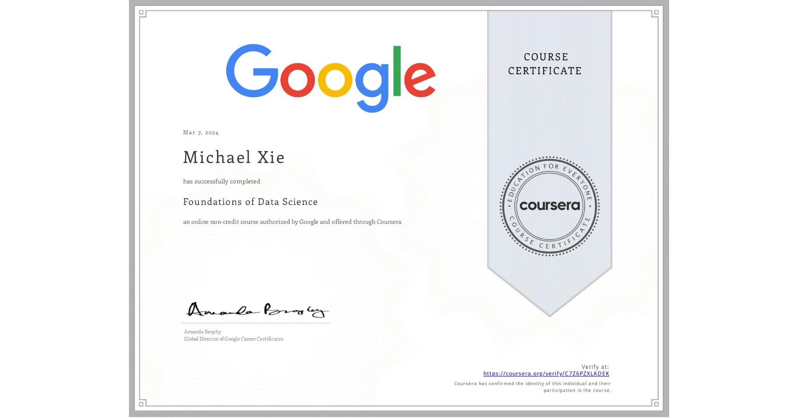

# Foundations of Data Science

## 📄 Main Topics 
- Understand common careers and industries that use advanced data analytics 
- Investigate the impact data analysis can have on decision-making 
- Explain how data professionals preserve data privacy and ethics 
- Develop a project plan considering roles and responsibilities of team members

## 🏆 Certificates 
To verify the certificates, click the images to follow the links.

  

