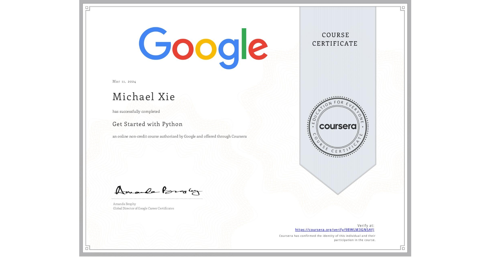

# Get Started with Python

## 📄 Main Topics 
- Explain how Python is used by data professionals 
- Explore basic python building blocks, including syntax and semantics 
- Understand loops, control statements, and string manipulation
- Use data structures to sotre and organise data

## 🏆 Certificates 
To verify the certificates, click the images to follow the links.

  

