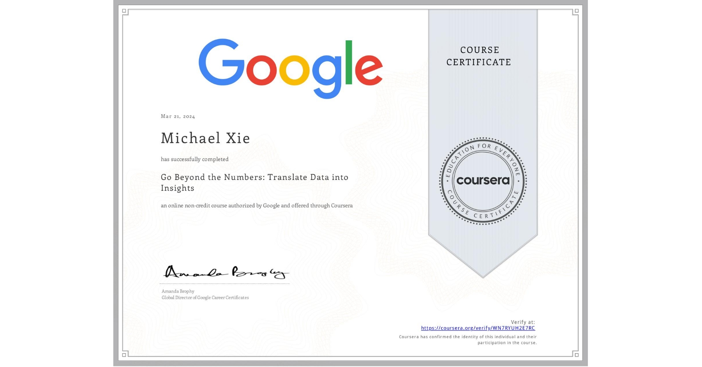

# Go Beyond the Numbers: Translate Data into Insights

## 📄 Main Topics 
- Apply the exploratory data analysis (EDA)
- Explore the benefits of structuring and cleaning data 
- Investigate raw data using Python 
- Create data visualisations using Tableau 

## 🏆 Certificates 
To verify the certificates, click the images to follow the links.

  

