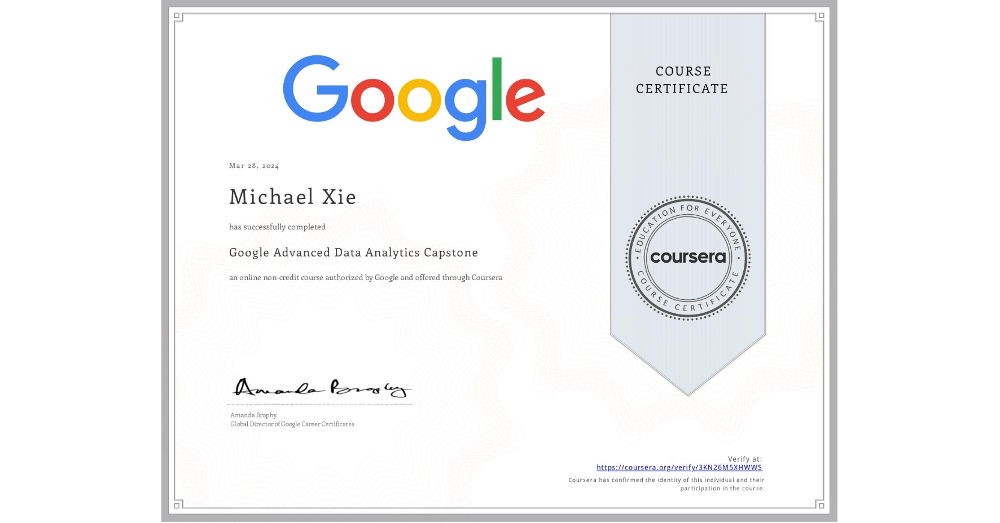

# Google Advanced Data Analytics Capstone 

## 📄 Main Topics 
- Examine data to identify patterns and trends
- Build models using machine learning techniques 
- Create data visualizations 
- Explore career resources 

## 🏆 Certificates 
To verify the certificates, click the images to follow the links.

  

