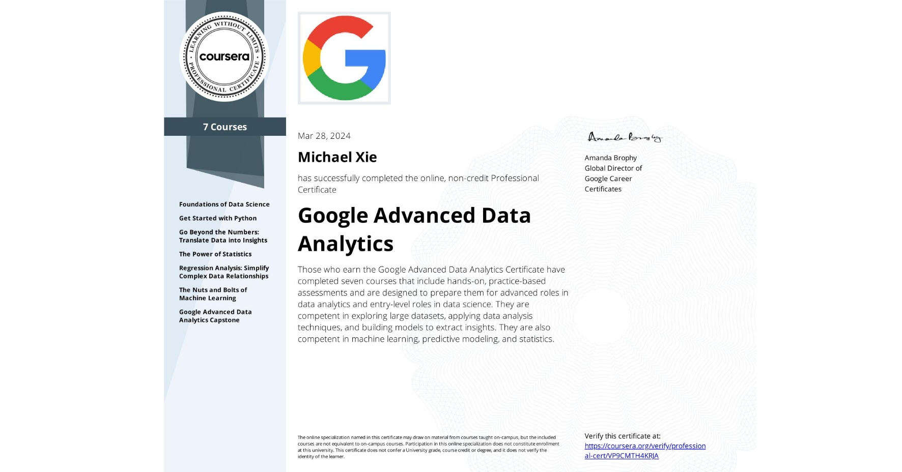

## 📄 About
The <a href="https://www.coursera.org/professional-certificates/google-advanced-data-analytics?">Google Advanced Data Anlaytics Professional Certificate</a> consists of 7 courses which covers in-demand skills like statistical analysis, Python, regression models, and machine learning.

This repository contains proof of certification for each course.

## 📑 Courses
- [Foundations of Data Science](Foundations%20of%20Data%20Science/)
- [Get Started with Python](Get%20Started%20with%20Python/)
- [Go Beyond the Numbers Translate Data into Insights](Go%20Beyond%20the%20Numbers%20Translate%20Data%20into%20Insights/)
- [Regression Analysis Simplify Complex Data Relationships](Regression%20Analysis%20Simplify%20Complex%20Data%20Relationships/)
- [The Nuts and Bolts of Machine Learning](The%20Nuts%20and%20Bolts%20of%20Machine%20Learning/)
- [The Power of Statistics](The%20Power%20of%20Statistics/)
- [Google Advanced Data Analytics Capstone](Google%20Advanced%20Data%20Analytics%20Capstone/)

## 🛠️ Tools
The following tools were used to complete this certification:    
  
  
  
  
  
  

(Python, Jupyter, GitHub, Tableau, Excel)

## 📖 Libraries
The following Python libraries were used throughout the certification:   

  
  
  
  
  
  
    
  

(Pandas, NumPy, SciPy, matplotlib, seaborn, plotly, scikit-learn)

## 🏆 Certificate 
To verify the certificates, click the images to follow the links.

  

