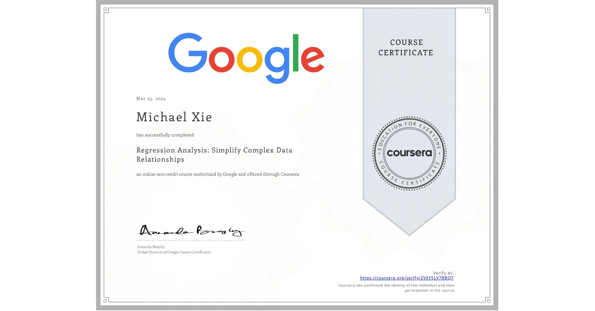

# Regression Analysis: Simplify Complex Data Relationships

## 📄 Main Topics 
- Investigate relationships in datasets
- Identify regression model assumptions 
- Perform linear and logistic regression using Python
- Practice model evaluation and interpretation

## 🏆 Certificates 
To verify the certificates, click the images to follow the links.

  

