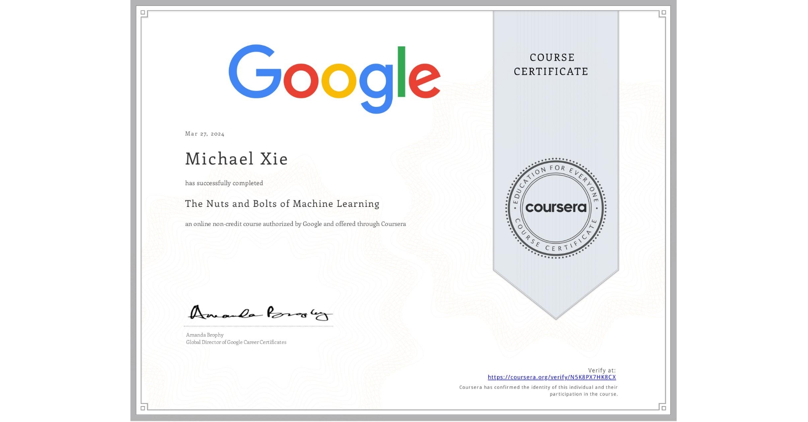

# The Nuts and Bolts of Machine Learning

## 📄 Main Topics 
- Identify characteristics of the different types of machine learning 
- Prepare data for machine learning models 
- Build and evaluate supervised and unsupervised learning models using Python
- Demonstrate proper model and metric selection for a machine learning algorithm

## 🏆 Certificates 
To verify the certificates, click the images to follow the links.

  

