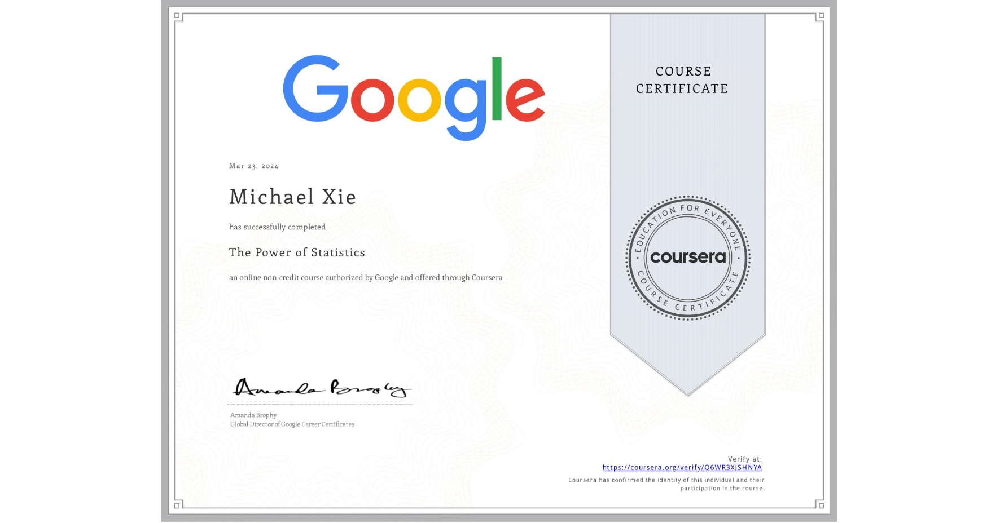

# The Power of Statistics 

## 📄 Main Topics 
- Explore and summarise a dataset
- Use probability distributions to model data 
- Conudct a hypothesis test to identify insights about data 
- Perform statistical analyses using Python 

## 🏆 Certificates 
To verify the certificates, click the images to follow the links.

  

